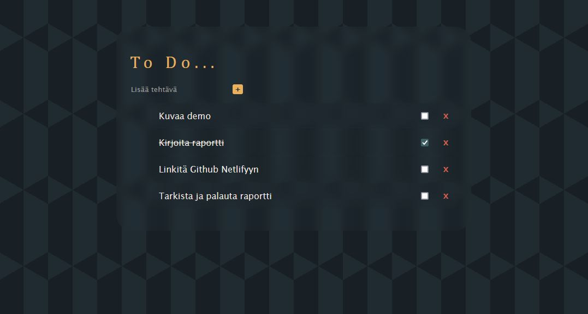

# To Do -sovellus
Kauri H

## Demo link:
Access the app at [kaurih-todo.netlify.app](https://kaurih-todo.netlify.app/)

## Table of Content:

- [About The App](#about-the-app)
- [Screenshots](#screenshots)
- [Technologies](#technologies)
- [Setup](#setup)
- [Status](#status)
- [Credits](#credits)
- [License](#license)

## About The App
To Do -sovellus is an app that stores user input in the browser's local storage and compiles a to do list of the user's input. Added tasks can be checkmarked to indicate they've been complete. Tasks can also be removed from the list.

## Screenshots

Picture by me

## Technologies
HTML - to make the app visible in browser.
CSS - to style the app window.
JavaScript - to add dynamic functionality to the app.

## Setup
- Navigate to [kaurih-todo.netlify.app](https://kaurih-todo.netlify.app/)
- Click the 'Lisää tehtävä' field to write a task
- Click the + button on the side
- Checkmark a task when you've completed it!
- Remove a task from the list by clicking the 'X' button.
- Your tasks are stored in the browser's local storage - close the browser and return later to see your tasks again.

## Status
To Do -sovellus is considered 'potentially finished'. As my first JavaScript project I'd like to improve upon it, but I might just rewrite the whole code at a later date, as I'm not super happy with how it turned out. As of now the code is quite hard to edit.

## Credits
Tutorials I watched and learned from
- [Web Dev Simplified](https://youtu.be/y17RuWkWdn8?si=tdcOkXMqoUdzrbM0) DOM manipulation basics.
- [Bro Code](https://youtu.be/NO5kUNxGIu0?si=S139e-eCsk09gNzM) DOM manipulation basics.

- [GreatStack](https://youtu.be/G0jO8kUrg-I?si=z5K_y3OMUPcj4qkT) general JS code structuring example.
- [dcode](https://youtu.be/cijPd-TXPn4?si=d_0orztoIeeZ7Y0D) general JS code structing example example.

- [CodePhilip](https://youtu.be/p6F5TBxs88A?si=m93BE1_opDbh9doZ) JS syntax and localstorage usage.
- [ProMaker Dev](https://youtu.be/fYTTUBa-lPc?si=jyFpVEwrGyfVM3bm) Localstorage understanding.

- [Coding2Go](https://youtu.be/PL3Odw-k8W4?si=z77-HiJZ45bHbBts&t=170) CSS glass effect
- [Optimistic Web](https://youtu.be/d3frDy-q3sY?si=DKxmjiFm4XdXwCdM) CSS gradient background effect

AI's used
- [ChatGPT](https://chatgpt.com/) was used to help with hunting down typos and debugging the load/save functions.

## License

MIT license @ [kaurih](kaurih@github.com)

I will not accept push or pull requests tho.